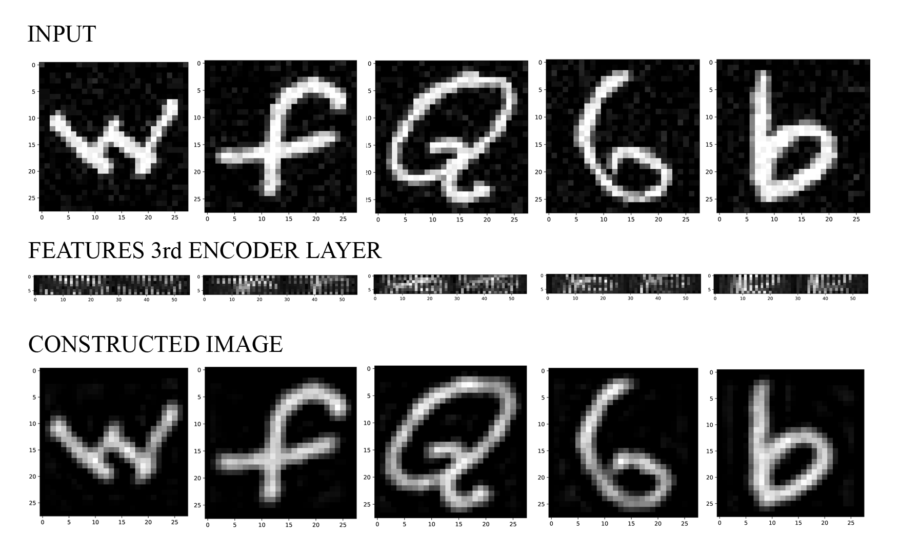

# cnn-autoencoder-tf
Convolutional Neural Network and Autoencoder on EMNIST using Tensorflow (https://www.tensorflow.org/)

In this project, we are going to evaluate the performance of convolutional neural network (CNN) and convolutional autoencoder (CAE) models by conducting empirical study on simple image data (EMNIST dataset) [1]. This dataset consists of 28x28 images of handwritten characters that belong to 47 classes.

[1] Gregory Cohen, Saeed Afshar, Jonathan Tapson, and Andre van Schaik. EMNIST: an
extension of MNIST to handwritten letters. arXiv preprint arXiv:1702.05373, 2017.

### Run the code

#### Parameters
- lr: initial learning rate
- mm: momentum
- bsz: batch size

### CNN

Train CNN
```
python --task="train_cnn" --lr=0.1 --mm=0.2 --bsz=32
```

Cross Validation CNN
```
python --task="cross_valid_cnn"
```

Test CNN
```
python --task="test_cnn" --lr=0.1 --mm=0.2 --bsz=32
```

#### Autoencoder

Train AE
```
python --task="train_ae" --lr=0.1 --mm=0.2 --bsz=32
```

Cross Validation AE
```
python --task="cross_valid_ae"
```

Test AE
```
python --task="evaluate_ae" --lr=0.1 --mm=0.2 --bsz=32
```

### Results


### Note

COMP5212 - Machine Learning Programming Assignment 2 in HKUST
